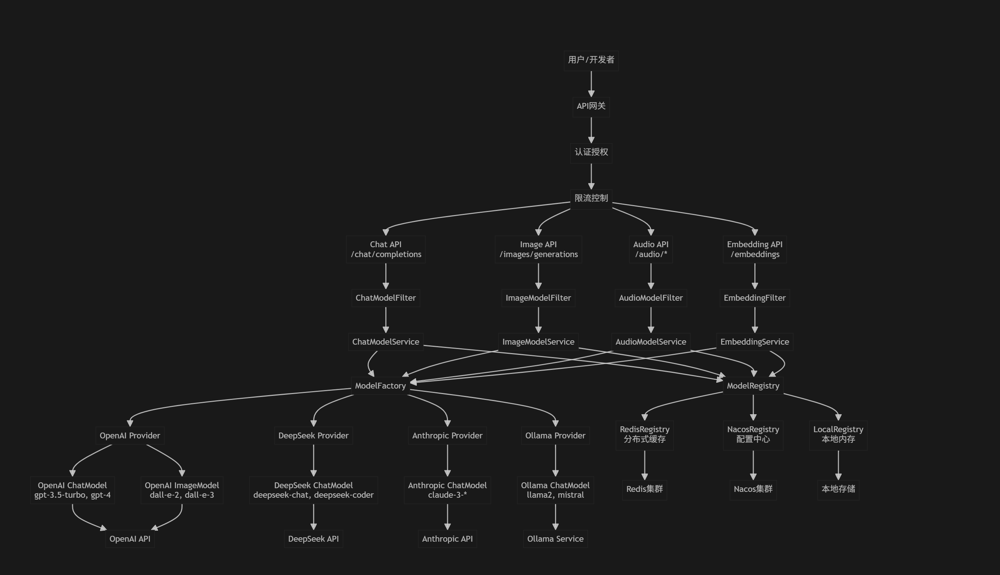
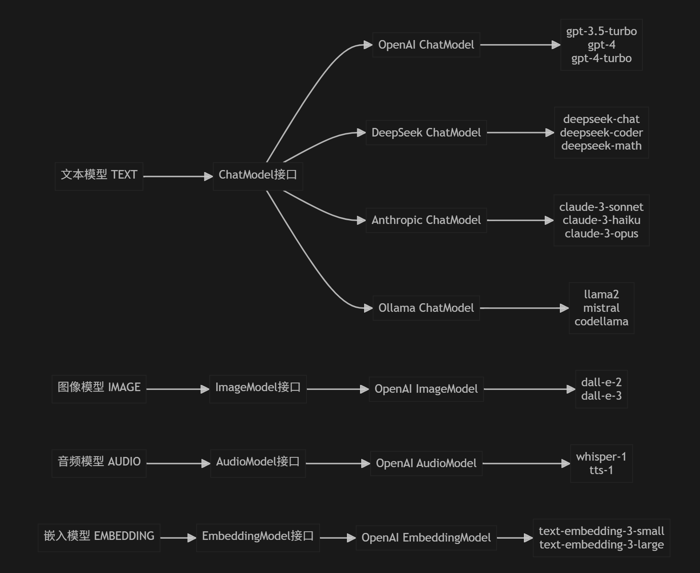
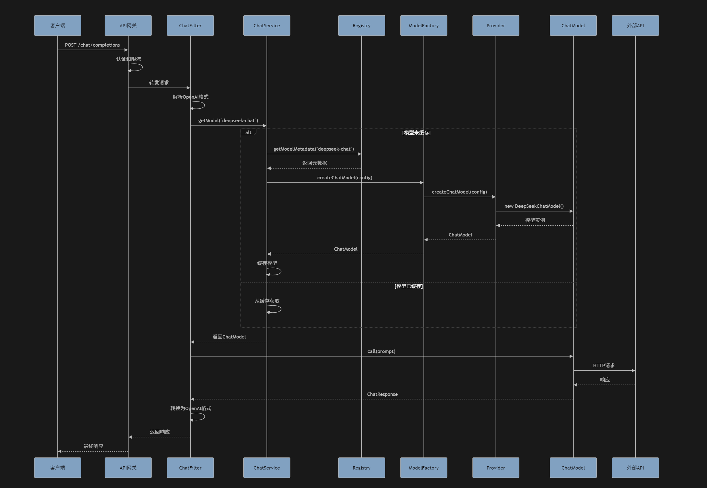
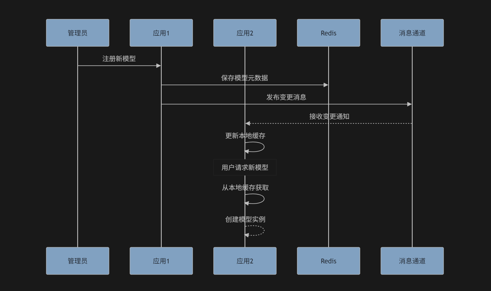
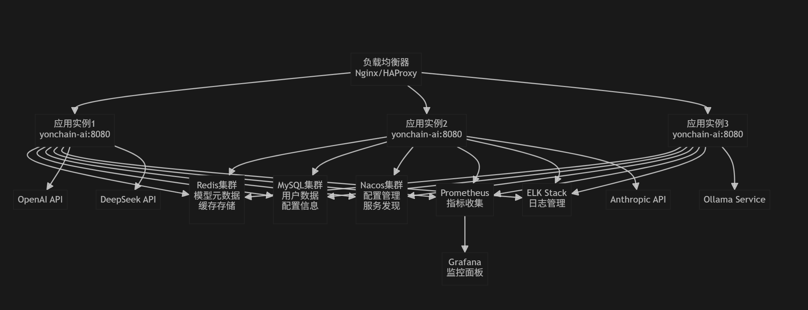
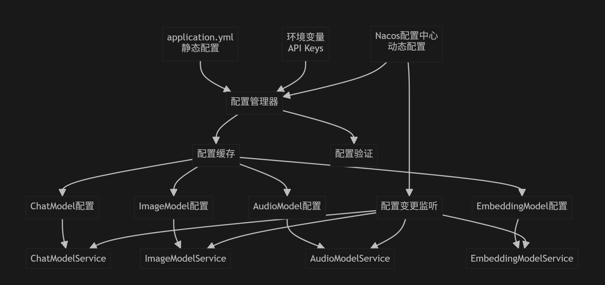

# 🚀 永链 AI 模型管理平台 | 统一接入、智能路由、开箱即用

这是一个面向企业的开源“统一模型管理平台”。通过“插件化 + OpenAI 兼容”的方式，统一接入主流模型提供商（OpenAI、DeepSeek、Anthropic、Ollama、Grok 等），并提供智能路由、弹性容错与成本优化，让多个业务系统在无需关心模型差异的前提下，稳定、低成本地使用大模型能力。

平台专注“模型治理与调用编排”：提供统一接口、集中配置、注册中心与缓存、权限与审计等企业级能力，完整开源、可私有化部署，适合多系统统一接入与治理。

## 🌟 为什么需要统一模型管理？

当企业有多个系统（客服、知识助手、BI、研发工具等）需要调用大模型时，常见问题会迅速放大：
- 配置散落：各系统各自保存 API Key、Endpoint、参数；密钥轮换与审计困难
- 成本不可见：无法按系统/项目/用户统计 token 与费用，预算失控
- 稳定性脆弱：429 限流/超时/波动频繁，缺乏统一重试、熔断、降级
- 重复接入：每个系统都要适配不同 SDK 与细节，交付慢、维护重
- 供应商锁定：难以跨云/跨供应商自由切换，灵活性差
- 接口碎片化：不同厂商的 REST/SDK、参数命名、流式返回格式各不相同；在本平台下，按模型类型（chat/image/embedding/audio）只需掌握一套统一接口（OpenAI 兼容），即可无感调用不同厂商与不同型号

永链的目标：像管理数据库连接池一样，标准化管理“模型连接与调用”，把模型治理变成基础设施。

## ✨ 关键特性

- **插件化集成**：以插件/JAR 扩展提供商与模型类型，支持自动扫描与热加载。
- **OpenAI 全兼容**：兼容 `/v1/chat/completions`、`/v1/images/generations`、`/v1/embeddings` 等接口。
- **智能省钱路由**：按“价格/限额/延迟/成功率/合规域”多维选路，支持降级与重试，尽量减少成本。
- **多模型多提供商**：文本、图像、音频、嵌入等模型统一抽象，支持一个实现复用多个具体模型。
- **企业级能力**：多租户、RBAC、审计日志、配额与预算、访问密钥管理。
- **分布式友好**：支持本地/Redis/配置中心等多种注册中心与缓存策略，面向集群与弹性扩缩。
- **国产化适配**：数据库、中间件、操作系统、CPU 架构与国密算法适配能力完善。

### 平台能力矩阵
- **集中配置中心**：统一管理 API Key、Endpoint、默认参数；支持文件/数据库/配置中心/运行时 API 动态刷新
- **运行时模型选择**：`ModelResolver` 按提供商/能力/成本/地域合规/AB灰度等策略路由
- **模型元数据与状态**：型号、能力、上下限、功能特性、健康度；配合心跳/探活
- **可观测性**：Micrometer/OpenTelemetry 指标、链路与结构化日志；Token/费用统计与看板
- **健壮性**：重试、超时、熔断、限流、故障转移、降级链；保护预算与 SLA

## 🔌 内置与可选提供商

- **OpenAI**：GPT、DALL·E、Whisper、Embeddings（`models/yonchain-ai-openai`、`plugins/openai`）
- **DeepSeek**：deepseek-chat、deepseek-coder、deepseek-math（`models/yonchain-ai-deepseek`、`plugins/deepseek`）
- **Anthropic**：Claude 3 系列（`models/yonchain-ai-anthropic`）
- **Ollama**：本地开源模型（`models/yonchain-ai-ollama`）
- **Grok/更多**：按需拓展（`models/yonchain-ai-grok`）

> 通过 `yonchain.plugin.*` 配置项可开启自动扫描与加载插件 JAR。

## 💰 成本优化（FinOps for AI）

- **实时/离线价目**：内置各提供商价格模型，可配置覆盖；统一换算请求成本
- **策略路由**：简单任务优先走低价模型（如 Haiku/3.5），复杂任务用高性能（如 4o/Sonnet）
- **基于 Token 的预算**：按系统/租户/Key 设定日/月配额，接近阈值自动告警或切换至低价模型
- **成本归因**：按系统/团队/场景统计 Token 与费用；识别异常消费与优化空间
- **降级容错**：429/5xx 自动退避与模型切换，保障连续性，避免因故障导致的隐性成本

## 🗂 市面常用模型/提供商一览（持续更新）

| 提供商 | 典型模型 | 类型 | 支持状态 |
|---|---|---|---|
| OpenAI | gpt-4o, gpt-4o-mini, o1, o1-mini, dall-e-3, whisper-1, text-embedding-3-large | 文本/多模态/图像/音频/嵌入 | 已支持 |
| DeepSeek | deepseek-chat, deepseek-coder | 文本 | 已支持 |
| Anthropic | claude-3.5-sonnet, claude-3.5-haiku | 文本/多模态 | 已支持 |
| xAI | grok-2 | 文本 | 已支持 |
| Ollama（本地开源模型） | llama3、qwen2.5、mistral、mixtral、phi3、gemma2 等 | 文本/部分多模态 | 已支持 |
| Google | gemini-1.5-pro、gemini-1.5-flash | 文本/多模态 | 规划中 |
| Meta | llama 3.1 8B/70B/405B | 文本/多模态 | 通过 Ollama/推理服务 |
| Mistral AI | mistral-large、mixtral-8x7b | 文本 | 规划中 |
| Cohere | command-r+、command-r、embed-multilingual-v3 | 文本/嵌入 | 规划中 |
| Stability AI | stable-diffusion-xl、stable-diffusion-core | 图像 | 规划中 |
| 阿里云 通义千问 | qwen2.5、qwen2.5-coder、qwen-vl | 文本/多模态 | 规划中 |
| 百度 文心一言 | ernie-4.0、ernie-3.5 | 文本/多模态 | 规划中 |
| 腾讯 混元 | hunyuan-pro | 文本/多模态 | 规划中 |
| 讯飞 星火 | spark-4.0 | 文本/语音 | 规划中 |
| 字节 豆包 | doubao-pro-32k 等 | 文本/多模态 | 规划中 |
| 智谱 AI | glm-4、glm-4-flash | 文本/多模态 | 规划中 |
| Moonshot（月之暗面） | moonshot-v1-8k/32k/128k | 文本 | 规划中 |
| MiniMax | abab6.5、abab6.5s | 文本/多模态 | 规划中 |
| 商汤 SenseNova | sensechat / 算法家族 | 文本/多模态 | 规划中 |
| 01.AI | yi-34b、yi-9b | 文本 | 规划中 |

说明：
- “已支持”表示仓库已有模块或插件；“规划中”表示在路线图内，欢迎提交需求优先级。
- 多数开源模型可通过 `Ollama` 或私有推理服务（如 vLLM、TGI）接入并由本系统进行统一治理。

## 🧠 工作方式（简述）

- 所有模型实现遵循 Spring AI 标准接口；
- 统一的 `ModelService` 负责实例缓存、生命周期与调用编排；
- 通过注册中心获取模型元数据，运行时按策略进行智能选择与回退；
- 对外以 OpenAI 兼容协议提供统一 API，便于对接现有 SDK。

### 体系结构与时序













更多详解请见 `docs/model/yonchain-ai-architecture-overview.md`。

## 🧱 与 API 网关（如 Higress）的关系

- 网关（Higress/Ingress/Kong/Apisix）：负责 SSL 终止、鉴权、WAF、防护与南北向通用流量管理
- 永链模型平台：理解“模型语义”，执行基于成本/能力/合规/健康度的模型级路由、熔断、降级、Token 限流与成本核算
- 推荐架构：外部请求先经网关，再路由到本平台，由平台完成 AI 原生治理与选择，然后访问具体模型提供商

二者协同而非替代：网关管“流量”，本平台管“模型”。

## ⚙️ 快速开始

### 环境准备
- JDK 17+
- Maven 3.9+
- 可选：PostgreSQL/MySQL、Redis（用于注册中心/缓存/配额）

### 构建与运行
```bash
# Windows
./mvnw.cmd -DskipTests=true package

# macOS/Linux
./mvnw -DskipTests=true package

# 启动（默认 8080 端口）
java -jar yonchain-ai-bootstart/target/yonchain.jar
```

### 最简单的调用示例
```bash
curl -X POST "http://localhost:8080/v1/chat/completions" \
  -H "Content-Type: application/json" \
  -H "Authorization: Bearer <YOUR_API_KEY>" \
  -d '{
        "model":"deepseek-chat",
        "stream": false,
        "messages":[{"role":"user","content":"你好，帮我写一段欢迎词"}]
      }'
```

> 也兼容旧路径 `/chat/completions`（以系统配置为准）。Swagger UI：`http://localhost:8080/swagger-ui/index.html`。

### 常用环境变量（示例）
```bash
OPENAI_API_KEY=sk-...
DEEPSEEK_API_KEY=sk-...
ANTHROPIC_API_KEY=sk-...
```

## 🔐 企业与合规

- 多租户、RBAC 权限、审计日志
- API Key/JWT/OAuth2 等多种鉴权方式
- 国密算法（SM2/SM3/SM4）适配能力
- 私有化部署与数据合规

## ☁️ 与云平台（如阿里“百炼”）的区别

- 中立与可移植：不绑定单一云或模型，适合多云/混合云/本地化部署
- Spring 原生体验：面向 Spring Boot 应用提供 Starter、配置范式与依赖注入，开发集成更顺滑
- 成本治理优先：跨厂商统一成本归因、预算控制与“性价比路由”
- 轻量可控：仅聚焦模型治理，不强制引入重型全家桶

云平台适合“全托管+强绑定”的团队；本平台适合追求灵活、中立与私有化可控的企业。

## 🗺️ Roadmap（节选）

- 更多国内外主流提供商适配（Gemini、ERNIE、Qwen、Spark、GLM、MiniMax 等）
- 评估/A-B 实验与质量度量；基于效果反馈的自适应路由
- 成本看板与告警中心；账单导出与对账
- 私有推理服务（vLLM、TGI、SGLang）更深适配与自动横向扩缩

## 📄 License

本项目采用 Apache-2.0 协议，商业可用，欢迎贡献插件与适配器。

## 📋 更新日志

### v0.1.0 (2024-09-22)
- **配置数据格式统一化**：优化模型提供商配置数据的获取和保存格式，解决数据格式不一致问题
  - 增强获取配置接口：自动填充已保存配置值到config_items的value字段
  - 优化保存配置逻辑：支持多种输入格式（扁平化和嵌套格式）
  - 新增统一格式保存接口：`/model-providers/config/unified`
  - 保持向后兼容性：原有接口格式继续支持

## 📚 图片与参考来源说明

本仓库中 `docs/model/*.png` 与架构文档的示意图均由我们自行绘制，主要参考并结合以下公开资料与实践经验进行抽象与取舍：

- `Spring AI` 的模型接口抽象与生态思路
- `OpenAI API` 的接口设计与请求/流式响应规范
- 行业通行的“多提供商模型路由与成本优化”实践理念
- `Resilience4j` 等弹性治理模式（重试、熔断、限流、隔离）

以上参考仅用于架构思路与术语统一，所有图形与实现均为自主设计与编码。

## 联系我们

### 作者微信


> **法律声明**：本项目是独立开发的开源项目，与Dify无商业关联，所有企业级功能均为自主研发实现。


