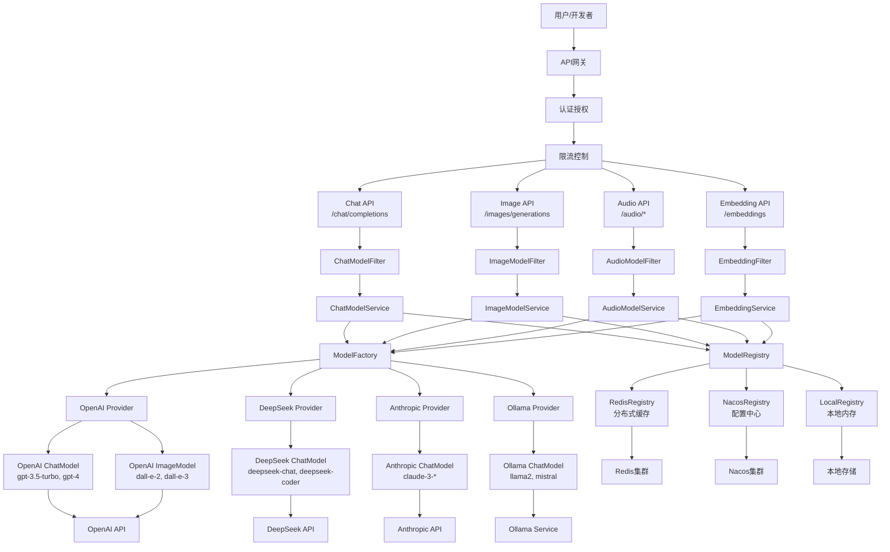
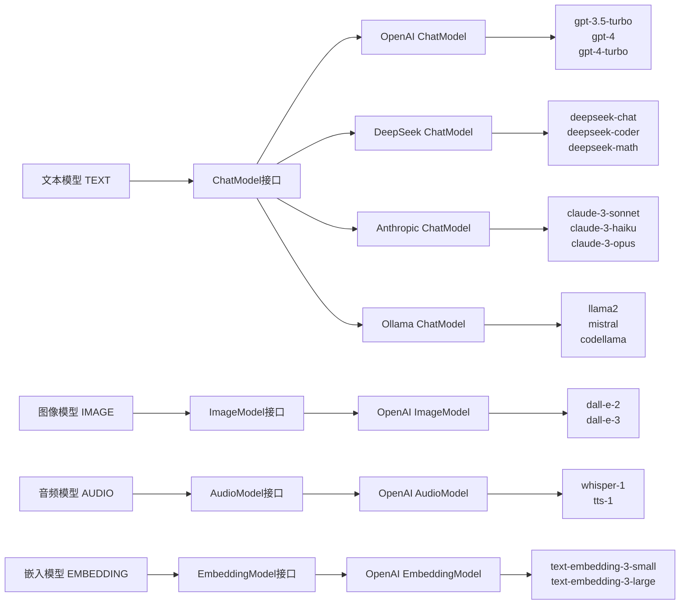
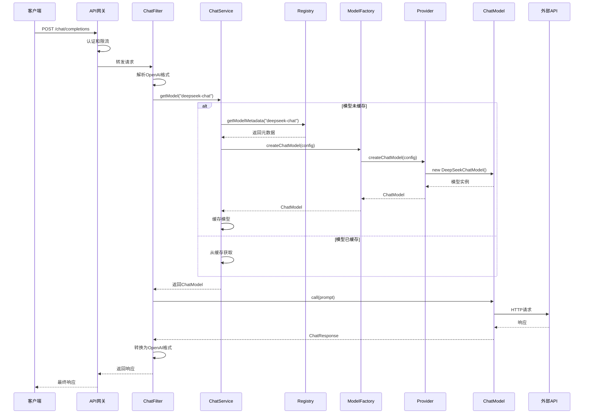
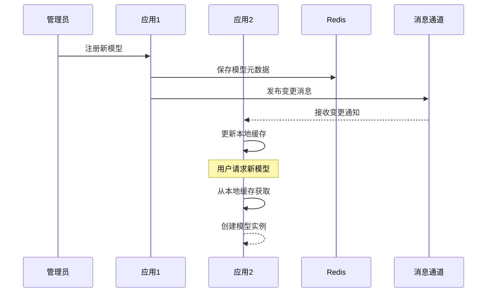
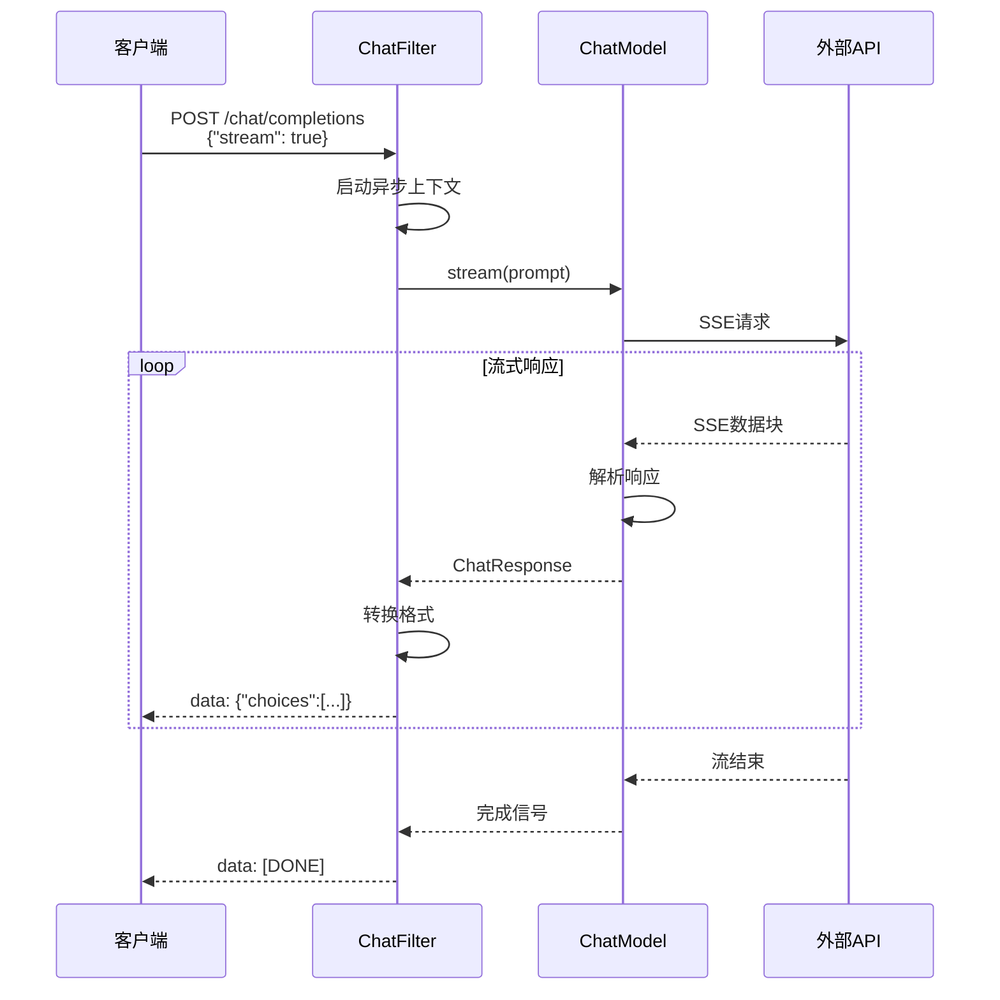
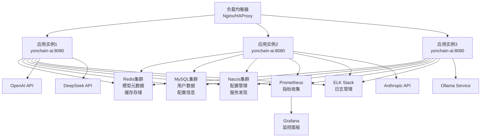
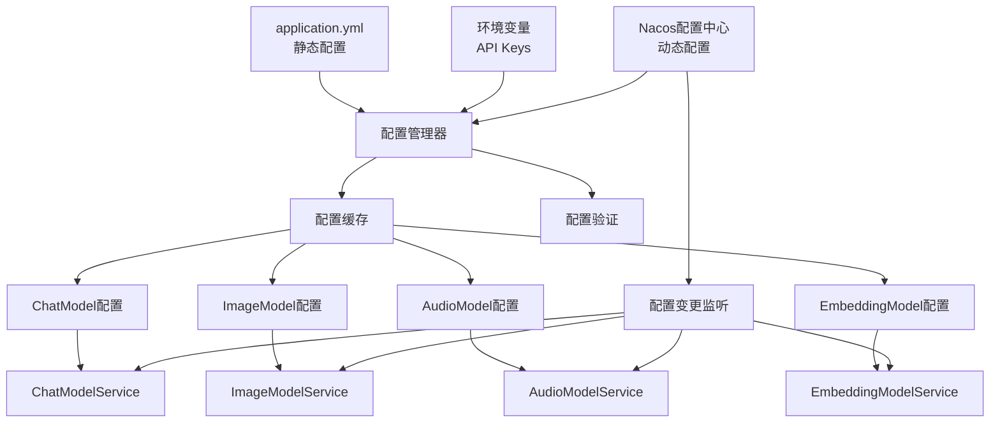

# 永链AI模型管理系统架构总览

## 目录
- [系统概述](#系统概述)
- [核心设计原则](#核心设计原则)
- [系统架构图](#系统架构图)
- [时序图](#时序图)
- [核心组件详解](#核心组件详解)
- [技术特性](#技术特性)
- [部署架构](#部署架构)
- [配置管理](#配置管理)
- [扩展指南](#扩展指南)

## 系统概述

永链AI模型管理系统是一个企业级的AI模型管理平台，类似于OpenAI的模型提供商，集成了市面上主流的AI模型提供商（OpenAI、DeepSeek、Anthropic、Ollama等）。系统遵循OpenAI接口规范，基于Spring AI框架设计，提供统一的模型调用接口。

### 核心功能
- **多模型支持**：文本、图像、音频、嵌入等多种模型类型
- **多提供商集成**：OpenAI、DeepSeek、Anthropic、Ollama等
- **OpenAI兼容**：完全兼容OpenAI API规范
- **分布式部署**：支持集群部署和水平扩展
- **企业级特性**：认证授权、监控审计、配置管理

## 核心设计原则

1. **OpenAI API兼容**：完全遵循OpenAI接口规范，无缝替换
2. **Spring AI标准**：所有模型实现遵循Spring AI接口
3. **分布式友好**：支持分布式注册中心和集群部署
4. **职责单一**：ModelService专注模型调用，不涉及元数据管理
5. **模型复用**：一个实现类支持多个具体模型
6. **插件化架构**：易于添加新的模型类型和提供商
7. **配置驱动**：支持多种配置源和动态更新

## 系统架构图

### 总体架构图



### 模型类型和提供商映射图



## 时序图

### 请求处理时序图



### 分布式注册中心同步时序图



### 流式响应处理时序图



## 核心组件详解

### 1. 模型服务层 (Model Service Layer)

模型服务层是系统的核心，专注于模型调用管理：

```java
public interface ModelService<M extends Model> {
    /**
     * 根据模型名称获取模型实例
     * 这是核心方法，用于获取可调用的模型对象
     */
    M getModel(String modelName);
}
```

**核心特性：**
- **职责单一**：只负责模型的获取和调用
- **实例缓存**：提供模型实例的缓存管理
- **生命周期管理**：监听注册中心变化，动态更新模型

### 2. 模型注册中心 (Model Registry)

支持多种注册中心实现，适应不同部署环境：

| 注册中心类型 | 适用场景 | 特点 |
|-------------|----------|------|
| LocalRegistry | 单机部署、开发环境 | 内存存储，快速启动 |
| RedisRegistry | 分布式部署 | 分布式缓存，消息通知 |
| NacosRegistry | 微服务架构 | 配置中心，服务发现 |
| HybridRegistry | 大规模生产 | 多级缓存，高性能 |

### 3. 模型工厂层 (Model Factory Layer)

负责根据配置创建不同类型的模型实例：

```java
public interface ModelProvider {
    String getProviderName();
    boolean supports(ModelType type);
    ChatModel createChatModel(ModelConfig config);
    ImageModel createImageModel(ModelConfig config);
    // ... 其他模型类型
}
```

**支持的提供商：**
- **OpenAI Provider**：GPT、DALL-E、Whisper、Embeddings
- **DeepSeek Provider**：deepseek-chat、deepseek-coder、deepseek-math
- **Anthropic Provider**：Claude-3系列
- **Ollama Provider**：本地部署的开源模型

### 4. Spring AI模型实现层

所有模型实现都遵循Spring AI标准接口：

```java
// 文本模型
public class DeepSeekChatModel implements ChatModel {
    public ChatResponse call(Prompt prompt) { ... }
    public Flux<ChatResponse> stream(Prompt prompt) { ... }
}

// 图像模型  
public class OpenAIImageModel implements ImageModel {
    public ImageResponse call(ImagePrompt prompt) { ... }
}
```

**设计优势：**
- **统一接口**：所有模型都通过标准接口调用
- **模型复用**：一个实现类支持多个具体模型
- **Spring AI兼容**：完全符合Spring AI规范

## 技术特性

### OpenAI API兼容

系统完全兼容OpenAI API规范，支持以下接口：

| 接口 | 路径 | 功能 |
|------|------|------|
| 聊天接口 | `POST /v1/chat/completions` | 文本对话、流式响应 |
| 图像接口 | `POST /v1/images/generations` | 图像生成、编辑 |
| 音频接口 | `POST /v1/audio/transcriptions` | 语音转文字 |
| 音频接口 | `POST /v1/audio/speech` | 文字转语音 |
| 嵌入接口 | `POST /v1/embeddings` | 文本向量化 |
| 模型接口 | `GET /v1/models` | 模型列表查询 |

### 分布式特性

- **水平扩展**：支持多实例部署和负载均衡
- **数据一致性**：通过消息机制确保集群数据同步
- **故障切换**：支持自动故障检测和切换
- **配置热更新**：支持配置的动态更新

### 安全特性

- **多种认证方式**：API Key、JWT Token、OAuth2.0
- **细粒度权限**：RBAC权限模型，资源级访问控制
- **数据安全**：请求响应加密，敏感信息脱敏
- **审计日志**：完整的操作审计和安全审计

## 部署架构

### 部署架构图



### 技术栈

#### 核心框架
- **Spring Boot 3.x** - 主应用框架
- **Spring AI 1.0** - AI模型抽象层
- **Spring Security** - 安全认证框架
- **Spring Data** - 数据访问框架

#### 数据存储
- **MySQL/PostgreSQL** - 关系数据库
- **Redis** - 缓存和消息队列
- **Elasticsearch** - 日志搜索和分析
- **MongoDB** - 文档存储（可选）

#### 中间件
- **RabbitMQ/Kafka** - 消息队列
- **Nacos/Consul** - 配置中心和服务发现
- **Prometheus** - 监控指标收集
- **Grafana** - 监控数据可视化

#### 运维工具
- **Docker** - 容器化部署
- **Kubernetes** - 容器编排
- **ELK Stack** - 日志管理
- **Jaeger/Zipkin** - 分布式链路追踪

## 配置管理

### 配置管理架构图



### 配置示例

#### 基础配置 (application.yml)

```yaml
yonchain:
  ai:
    # 注册中心类型选择
    registry:
      type: redis  # local, redis, nacos, hybrid
      redis:
        host: localhost
        port: 6379
        database: 0
        password: 
    
    # 模型配置
    models:
      chat:
        - name: "deepseek-chat"
          provider: "deepseek"
          endpoint: "https://api.deepseek.com/v1"
          apiKey: "${DEEPSEEK_API_KEY}"
          maxTokens: 8192
          temperature: 0.7
          enabled: true
          properties:
            model: "deepseek-chat"
            
        - name: "gpt-3.5-turbo"
          provider: "openai"
          endpoint: "https://api.openai.com/v1"
          apiKey: "${OPENAI_API_KEY}"
          maxTokens: 4096
          temperature: 0.7
          enabled: true
          properties:
            model: "gpt-3.5-turbo"
      
      image:
        - name: "dall-e-3"
          provider: "openai"
          endpoint: "https://api.openai.com/v1"
          apiKey: "${OPENAI_API_KEY}"
          enabled: true
          properties:
            model: "dall-e-3"
            sizes: ["1024x1024", "1792x1024", "1024x1792"]
```

#### 环境变量配置

```bash
# API密钥
OPENAI_API_KEY=sk-...
DEEPSEEK_API_KEY=sk-...
ANTHROPIC_API_KEY=sk-ant-...

# 数据库配置
MYSQL_HOST=localhost
MYSQL_PORT=3306
MYSQL_DATABASE=yonchain_ai
MYSQL_USERNAME=root
MYSQL_PASSWORD=password

# Redis配置
REDIS_HOST=localhost
REDIS_PORT=6379
REDIS_PASSWORD=
```

## 扩展指南

### 添加新的模型类型

1. **定义模型类型枚举**
```java
public enum ModelType {
    TEXT, IMAGE, AUDIO, VIDEO, EMBEDDING, MULTIMODAL  // 添加新类型
}
```

2. **创建对应的Service接口**
```java
public interface VideoModelService extends ModelService<VideoModel> {
    VideoModel getModel(String modelName);
}
```

3. **创建对应的Filter**
```java
public class VideoModelFilter extends BaseModelFilter<VideoModel> {
    // 实现视频模型请求处理逻辑
}
```

### 添加新的模型提供商

1. **实现ModelProvider接口**
```java
@Component
public class CustomModelProvider implements ModelProvider {
    @Override
    public String getProviderName() {
        return "custom";
    }
    
    @Override
    public ChatModel createChatModel(ModelConfig config) {
        return new CustomChatModel(config);
    }
}
```

2. **实现Spring AI模型接口**
```java
public class CustomChatModel implements ChatModel {
    @Override
    public ChatResponse call(Prompt prompt) {
        // 实现具体的模型调用逻辑
    }
}
```

3. **添加配置支持**
```yaml
yonchain:
  ai:
    models:
      chat:
        - name: "custom-model"
          provider: "custom"
          endpoint: "https://api.custom.com/v1"
          apiKey: "${CUSTOM_API_KEY}"
          enabled: true
```

### 添加新的注册中心实现

1. **实现ModelRegistry接口**
```java
@Component
@ConditionalOnProperty(name = "yonchain.ai.registry.type", havingValue = "consul")
public class ConsulModelRegistry implements ModelRegistry {
    // 实现Consul注册中心逻辑
}
```

2. **添加自动配置**
```java
@Configuration
public class ConsulRegistryAutoConfiguration {
    @Bean
    @ConditionalOnProperty(name = "yonchain.ai.registry.type", havingValue = "consul")
    public ModelRegistry consulModelRegistry() {
        return new ConsulModelRegistry();
    }
}
```

## 总结

永链AI模型管理系统提供了一个完整的企业级AI模型管理解决方案，具有以下核心优势：

### 🎯 核心优势
- **OpenAI完全兼容** - 无缝替换OpenAI API
- **分布式友好** - 支持集群部署和水平扩展
- **多提供商支持** - 集成主流AI服务商
- **Spring AI标准** - 遵循业界标准接口
- **企业级特性** - 认证、授权、监控、审计
- **高可用设计** - 多级缓存、故障切换
- **灵活配置** - 支持多种配置源和动态更新

### 🚀 技术特性
- **模块化设计** - 组件解耦，易于维护
- **插件化架构** - 支持扩展新的模型和提供商
- **配置驱动** - 通过配置管理模型和提供商
- **云原生** - 支持容器化部署和微服务架构

### 📊 业务价值
- **降低成本** - 统一管理多个AI服务商
- **提升效率** - 标准化的API接口
- **增强安全** - 企业级的安全控制
- **便于运维** - 完善的监控和日志系统

这个架构为企业提供了一个稳定、可扩展、易维护的AI模型管理平台，能够很好地支撑各种AI应用场景的需求。
