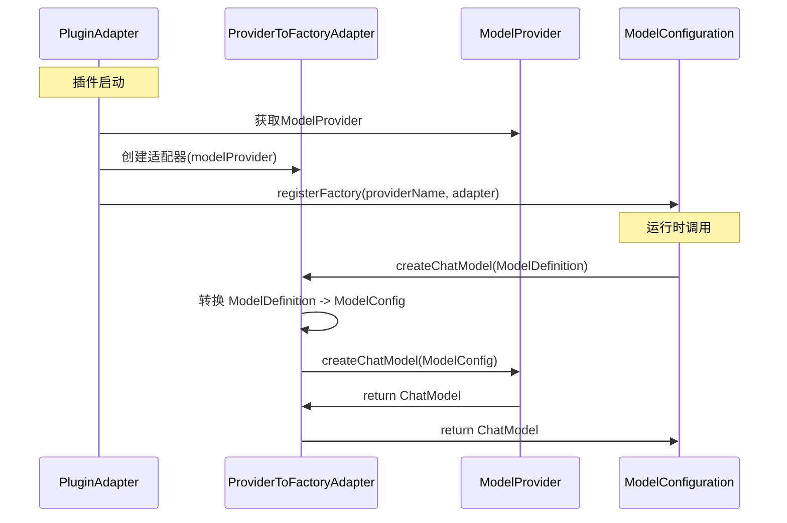

# 插件系统ModelFactory适配解决方案

## 🎯 问题解决

### **核心问题**
- **ModelFactory** (模型模块标准): `createChatModel(ModelDefinition definition)`
- **ModelProvider** (插件系统): `createChatModel(ModelConfig config)`
- 参数类型不一致，无法直接对接

### **解决方案：适配器模式**
创建 `ProviderToFactoryAdapter` 将 `ModelProvider` 适配为 `ModelFactory`，遵循模型模块标准。

## 🔧 实现架构

### 新的架构流程


### 核心组件

#### 1. **ProviderToFactoryAdapter** - 适配器核心
```java
public class ProviderToFactoryAdapter implements ModelFactory {
    
    private final ModelProvider modelProvider;
    
    @Override
    public ChatModel createChatModel(ModelDefinition definition) {
        // 1. 转换参数类型
        ModelConfig config = convertToModelConfig(definition);
        
        // 2. 调用ModelProvider
        return modelProvider.createChatModel(config);
    }
    
    private ModelConfig convertToModelConfig(ModelDefinition definition) {
        ModelConfig config = new ModelConfig();
        
        // 基本信息映射
        config.setName(definition.getId());
        config.setProvider(definition.getNamespace());
        config.setType(convertModelType(definition.getType()));
        
        // 认证信息映射
        config.setApiKey(definition.getAuthValue());
        config.setEndpoint(definition.getBaseUrl());
        
        // OptionsHandler集成 - 构建SpringAI选项
        buildSpringAiOptions(definition, config);
        
        return config;
    }
}
```

#### 2. **ModelPluginAdapter** - 简化注册
```java
@Override
public void onPluginEnable(String pluginId) throws PluginException {
    // ... 前面步骤
    
    // 5. 创建适配器，将ModelProvider适配为ModelFactory
    ProviderToFactoryAdapter factoryAdapter = new ProviderToFactoryAdapter(modelProvider);
    
    // 6. 直接注册适配器到ModelConfiguration（符合ModelFactory标准）
    modelConfiguration.registerFactory(modelProvider.getProviderName(), factoryAdapter);
    
    // ... 后续步骤
}
```

## 📊 优化效果

### ✅ **解决的问题**

1. **接口统一**: 插件提供商现在完全符合ModelFactory标准
2. **职责清晰**: 
   - `ModelProvider` - 插件系统的模型提供商接口
   - `ModelFactory` - 模型模块的工厂标准
   - `ProviderToFactoryAdapter` - 负责两者之间的适配
3. **简化注册**: 移除了复杂的双重注册机制
4. **保持兼容**: 模型模块标准完全不变

### 🔄 **架构对比**

| **方面** | **优化前** | **优化后** |
|---------|-----------|-----------|
| **注册机制** | 双重注册 (Provider→Factory→Configuration) | 直接注册 (Provider→Adapter→Configuration) |
| **接口一致性** | 参数类型不一致 | 完全符合ModelFactory标准 |
| **职责划分** | DefaultModelFactory职责过重 | 适配器专职转换，职责单一 |
| **依赖复杂度** | 依赖PluginModelFactory | 只依赖标准ModelFactory |

## 🚀 使用效果

### 插件启动流程
```java
// 1. 获取插件的ModelProvider
ModelProvider modelProvider = pluginInstance.getProvider();

// 2. 创建适配器
ProviderToFactoryAdapter adapter = new ProviderToFactoryAdapter(modelProvider);

// 3. 注册到模型配置（符合标准）
modelConfiguration.registerFactory(providerName, adapter);

// 4. 完成！插件现在完全符合模型模块标准
```

### 运行时调用
```java
// 模型模块调用（标准ModelFactory接口）
ModelFactory factory = modelConfiguration.getFactory("deepseek");
ChatModel chatModel = factory.createChatModel(modelDefinition);

// 内部流程：
// ModelDefinition -> 适配器转换 -> ModelConfig -> ModelProvider -> ChatModel
```

## 🔍 关键特性

### 1. **参数转换**
- `ModelDefinition` → `ModelConfig`
- 完整的字段映射和类型转换
- 保留所有必要信息

### 2. **OptionsHandler集成**
```java
private void buildSpringAiOptions(ModelDefinition definition, ModelConfig config) {
    if (definition.hasOptionsHandler()) {
        ModelOptionsHandler<?> handler = definition.resolveOptionsHandler();
        Object springAiOptions = handler.buildOptions(definition.getOptions());
        config.setProperty("springAiOptions", springAiOptions);
    }
}
```

### 3. **错误处理**
- 完整的异常捕获和日志记录
- 友好的错误信息
- 不影响其他插件运行

### 4. **类型安全**
- 正确的ModelType枚举转换
- 泛型支持
- 编译时类型检查

## 📋 实施效果

### **立即效果**
- ✅ 移除了对`DefaultModelFactory`的依赖
- ✅ 简化了`ModelPluginAdapter`的注册逻辑
- ✅ 完全符合模型模块的`ModelFactory`标准
- ✅ 保持了现有插件的兼容性

### **长期收益**
- 🎯 架构更加清晰，职责划分明确
- 🔧 易于维护和扩展
- 🚀 性能优化（减少了中间层）
- 📈 更好的可测试性

## 🎉 总结

通过引入 `ProviderToFactoryAdapter` 适配器，我们成功解决了插件系统与模型模块接口不一致的问题：

1. **遵循标准**: 完全符合模型模块的`ModelFactory`标准，无需修改模型模块
2. **简化架构**: 移除了复杂的双重注册和`DefaultModelFactory`依赖
3. **保持兼容**: 现有插件无需修改，自动获得适配能力
4. **集成OptionsHandler**: 无缝集成模型选项处理功能

**现在插件系统与模型模块实现了完美对接！** 🎯

