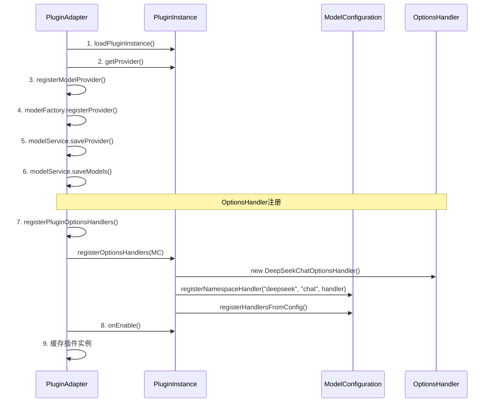
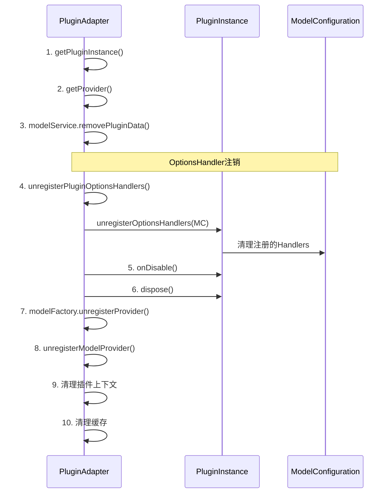

# ModelPluginAdapter集成OptionsHandler完整指南

## 🎯 概述

本文档说明了如何在 `ModelPluginAdapter` 中集成 `OptionsHandler` 的自动注册和注销功能，使插件系统能够在插件启动时自动注册模型选项处理器。

## 🔧 实现的功能

### 1. **插件启动时自动注册OptionsHandler**

```java
// 在 onPluginEnable 方法中添加
// 8. 注册OptionsHandlers到ModelConfiguration
registerPluginOptionsHandlers(pluginInstance, modelConfiguration);

// 9. 调用插件的启用回调
pluginInstance.onEnable();
```

### 2. **插件禁用时自动注销OptionsHandler**

```java
// 在 onPluginDisable 方法中添加
// 4. 注销OptionsHandlers
unregisterPluginOptionsHandlers(pluginInstance, modelConfiguration);

// 5. 调用插件的禁用回调
pluginInstance.onDisable();
```

### 3. **注册和注销的具体实现**

```java
/**
 * 注册插件的OptionsHandlers到ModelConfiguration
 */
private void registerPluginOptionsHandlers(ModelPlugin pluginInstance, ModelConfiguration modelConfiguration) {
    try {
        log.info("Registering OptionsHandlers for plugin: {}", pluginInstance.getId());
        
        // 调用插件的registerOptionsHandlers方法
        pluginInstance.registerOptionsHandlers(modelConfiguration);
        
        log.info("Successfully registered OptionsHandlers for plugin: {}", pluginInstance.getId());
        
    } catch (Exception e) {
        log.error("Failed to register OptionsHandlers for plugin: {}", pluginInstance.getId(), e);
        // 不抛出异常，允许插件继续启动，只是没有OptionsHandler支持
    }
}

/**
 * 从ModelConfiguration注销插件的OptionsHandlers
 */
private void unregisterPluginOptionsHandlers(ModelPlugin pluginInstance, ModelConfiguration modelConfiguration) {
    try {
        log.info("Unregistering OptionsHandlers for plugin: {}", pluginInstance.getId());
        
        // 调用插件的unregisterOptionsHandlers方法
        pluginInstance.unregisterOptionsHandlers(modelConfiguration);
        
        log.info("Successfully unregistered OptionsHandlers for plugin: {}", pluginInstance.getId());
        
    } catch (Exception e) {
        log.error("Failed to unregister OptionsHandlers for plugin: {}", pluginInstance.getId(), e);
        // 不抛出异常，继续禁用流程
    }
}
```

## 🔄 完整的插件生命周期

### 插件启用流程 (onPluginEnable)



### 插件禁用流程 (onPluginDisable)



## 📊 集成效果

### ✅ **已实现的功能**

1. **自动化注册**: 插件启动时自动调用 `pluginInstance.registerOptionsHandlers(modelConfiguration)`
2. **自动化注销**: 插件禁用时自动调用 `pluginInstance.unregisterOptionsHandlers(modelConfiguration)`  
3. **错误处理**: 注册/注销失败不会影响插件的正常启动/禁用
4. **日志记录**: 完整的操作日志，便于调试和监控
5. **生命周期管理**: 在适当的时机进行Handler的注册和注销

### 🔍 **验证方法**

```java
// 1. 启用插件后验证Handler注册
Optional<ModelOptionsHandler<DeepSeekChatOptions>> handler = 
    modelConfiguration.getHandler("deepseek:chat");
assert handler.isPresent() : "Handler应该已注册";

// 2. 测试Handler解析
ModelOptionsHandler<DeepSeekChatOptions> resolvedHandler = 
    modelConfiguration.resolveHandler("deepseek", "deepseek-chat", "chat", null);
assert resolvedHandler != null : "Handler应该可以解析";

// 3. 测试选项构建
Map<String, Object> config = Map.of("model", "deepseek-chat", "temperature", 0.7);
DeepSeekChatOptions options = resolvedHandler.buildOptions(config);
assert options != null : "应该能构建选项";
```

## 🚀 使用示例

### 基本使用

```java
// 创建插件适配器和模型配置
ModelPluginAdapter pluginAdapter = new ModelPluginAdapter(...);
ModelConfiguration modelConfiguration = new ModelConfiguration();

// 启用插件 (自动注册OptionsHandlers)
pluginAdapter.onPluginEnable("deepseek-plugin");

// 使用注册的Handler
ModelOptionsHandler<DeepSeekChatOptions> handler = 
    modelConfiguration.resolveHandler("deepseek", "deepseek-chat", "chat", null);

Map<String, Object> config = Map.of(
    "model", "deepseek-chat",
    "temperature", 0.7,
    "maxTokens", 2048
);

DeepSeekChatOptions options = handler.buildOptions(config);

// 禁用插件 (自动注销OptionsHandlers)
pluginAdapter.onPluginDisable("deepseek-plugin");
```

### 插件重启场景

```java
// 首次启用
pluginAdapter.onPluginEnable("deepseek-plugin");
// Handler已注册，可以正常使用

// 禁用插件
pluginAdapter.onPluginDisable("deepseek-plugin");
// Handler已注销

// 重新启用
pluginAdapter.onPluginEnable("deepseek-plugin");
// Handler重新注册，恢复可用状态
```

## 📋 配置要求

### 1. **插件YAML配置**

```yaml
# deepseek.yaml
models:
  chat:
    source: org.springframework.ai.deepseek.DeepSeekChatModel
    options_handler: com.yonchain.ai.plugin.deepseek.DeepSeekChatOptionsHandler
```

### 2. **插件实现要求**

```java
public class DeepSeekPlugin implements ModelPlugin {
    
    @Override
    public void registerOptionsHandlers(ModelConfiguration modelConfiguration) {
        // 直接注册Handler实例
        DeepSeekChatOptionsHandler chatHandler = new DeepSeekChatOptionsHandler();
        modelConfiguration.registerNamespaceHandler("deepseek", "chat", chatHandler);
        
        // 从配置文件动态注册
        registerHandlersFromConfig(modelConfiguration);
    }
    
    @Override
    public void unregisterOptionsHandlers(ModelConfiguration modelConfiguration) {
        // 注销Handler (如果ModelConfiguration提供了注销API)
        log.info("Unregistering DeepSeek options handlers");
    }
}
```

## ⚠️ 注意事项

### 1. **错误处理策略**
- OptionsHandler注册失败不会阻止插件启动
- OptionsHandler注销失败不会阻止插件禁用
- 所有异常都会被捕获并记录日志

### 2. **注销限制**
- 当前 `ModelConfiguration` 可能没有提供Handler注销的API
- Handler可能会被缓存或通过约定规则动态创建
- 注销主要依赖插件的 `unregisterOptionsHandlers` 方法实现

### 3. **性能考虑**
- Handler注册是同步操作，在插件启动流程中执行
- 大量Handler注册可能会影响插件启动时间
- 建议在Handler实现中避免重量级的初始化操作

## 🎉 总结

通过在 `ModelPluginAdapter` 中集成 OptionsHandler 的自动注册和注销功能，插件系统现在可以：

1. **自动化管理**: 插件启动/禁用时自动处理Handler的注册/注销
2. **零配置使用**: 开发者无需手动管理Handler生命周期
3. **一致性保证**: 所有插件都遵循相同的Handler管理流程
4. **错误隔离**: Handler操作失败不会影响插件的正常功能
5. **完整生命周期**: 从插件安装到卸载的完整Handler管理

**这使得插件开发者只需要在插件类中实现 `registerOptionsHandlers` 方法，系统会自动在适当的时机调用，极大简化了插件开发的复杂性！**


